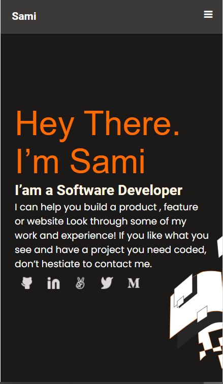
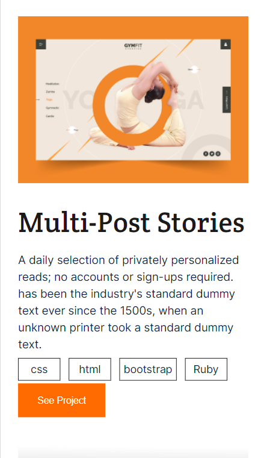
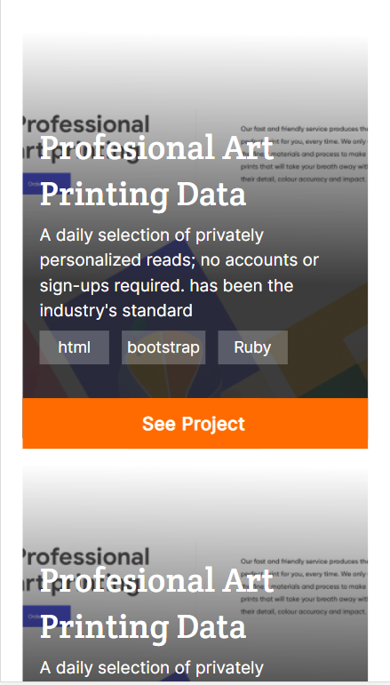
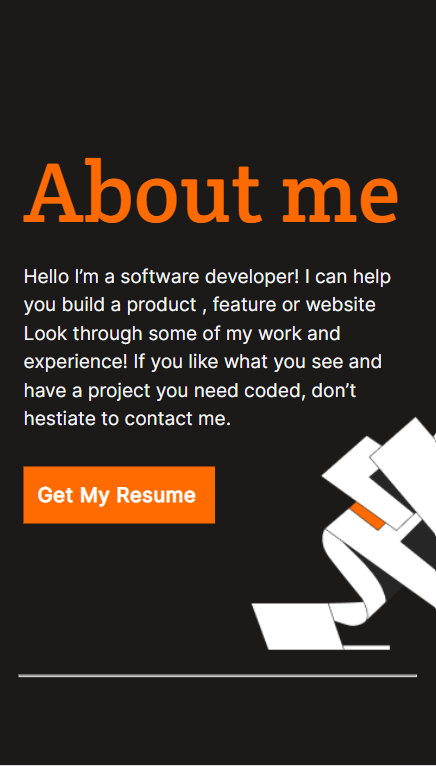
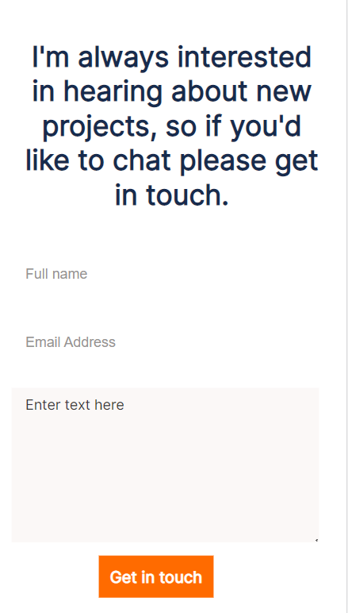

# Portfolio-project

- A mobile portfolio page showcasing my projects and skills

## Built With

- HTML
- CSS

## Getting Started
To get a local copy up and running follow these simple example steps:
## prerequisites
-must have git installed.
-must have vscode installed or any other IDE.
-must installed linters in the project

## setup
- git clone https://samiullah997.github.io/Portfolio-Mobile/
- cd Portfolio-Mobile

## Authors

👤 **Author Samiullah**

- GitHub: [@githubhandle]([https://github.com/githubhandle](https://github.com/samiullah997))
- Twitter: [@twitterhandle][(https://twitter.com/twitterhandle)](https://twitter.com/samiullahk997)
- LinkedIn: [LinkedIn][(https://linkedin.com/in/linkedinhandle)](https://www.linkedin.com/in/samiullah-khan-2702b7171/)

## LIVE DEMO
[Portfolio](https://sami-portfolio-site.netlify.app/)

## SCREENSHOTS

## 🤝 Contributing

Contributions, issues, and feature requests are welcome!

1. Fork the Project
2. Create your Feature Branch (`git checkout -b 'branchname`)
3. Commit your Changes (`git commit -m 'Add some branchname'`)
4. Push to the Branch (`git push origin branchname`)
5. Open a Pull Request

Feel free to check the [issues page](../../issues/).

## Show your support

Give a ⭐️ if you like this project!

## Acknowledgments

* [Choose an Open Source License](https://choosealicense.com)
* [GitHub Emoji Cheat Sheet](https://www.webpagefx.com/tools/emoji-cheat-sheet)
* [Malven's Flexbox Cheatsheet](https://flexbox.malven.co/)
* [Malven's Grid Cheatsheet](https://grid.malven.co/)
* [Img Shields](https://shields.io)
* [GitHub Pages](https://pages.github.com)
* [Font Awesome](https://fontawesome.com)

## 📝 License

This project is [MIT](./MIT.md) licensed.
